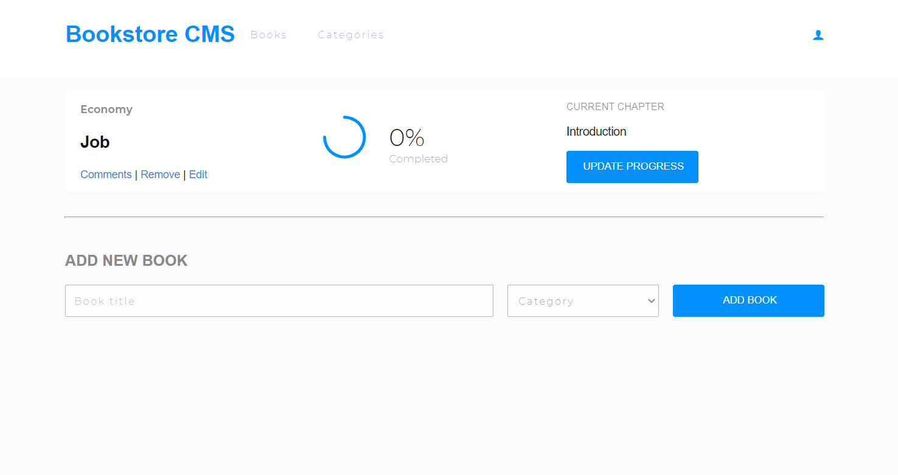

## Bookstore app
This project will lay foundations for your Bookstore website. You will create a React and Redux app. You will structure your files using the "feature folder" approach. You will also set up routing using React Router.

## Built With
- JavaScript/React
- React Router
- JSX
- CSS
  
## Setup
- Get the link of the repository: [https://github.com/chaw-bot/bookstore](https://github.com/chaw-bot/bookstore)
- Clone it as git@github.com:chaw-bot/bookstore.git on a Terminal
- Usage
- Run npm install on a Terminal to install the modules
- Run yarn start on a Terminal to start the server
- Open http://localhost:3000/bookstore to view it in the browser.
  
## Author

👤 **Chawanzi Ng'uni**

- GitHub: [@chaw-bot](https://github.com/chaw-bot)
- Twitter: [@chaw36422087](https://twitter.com/chaw36422087)
- LinkedIn: [Chawanzi Ng'uni](https://www.linkedin.com/in/chawanzi-ng-uni-449328212/)

## 🤝 Contributing

Contributions, issues, and feature requests are welcome!

Feel free to check the [issues page](https://github.com/chaw-bot/math-magician/issues).

## Show your support

Give a ⭐️ if you like this project!

## Acknowledgments
Microverse
React and React Router documentation
Stack Overflow